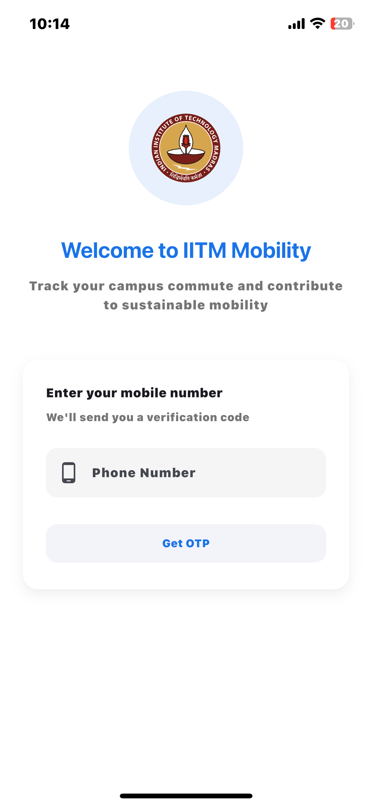
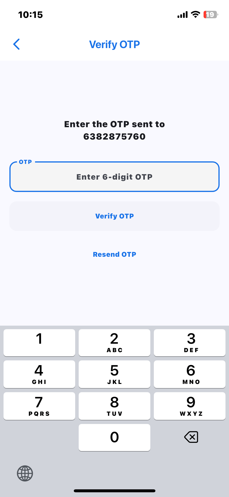
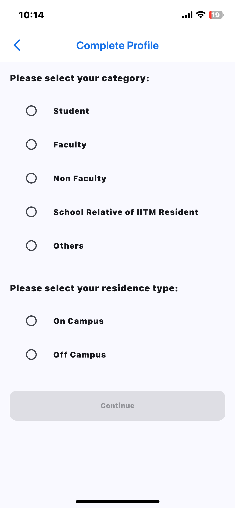
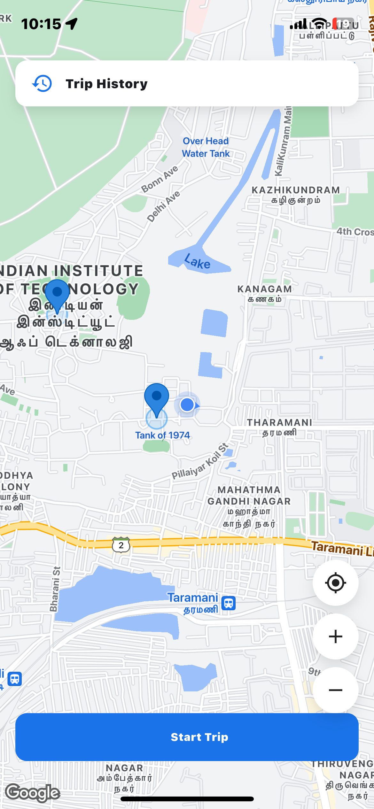
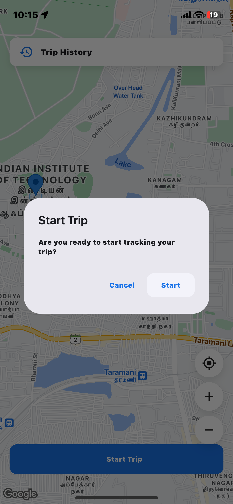
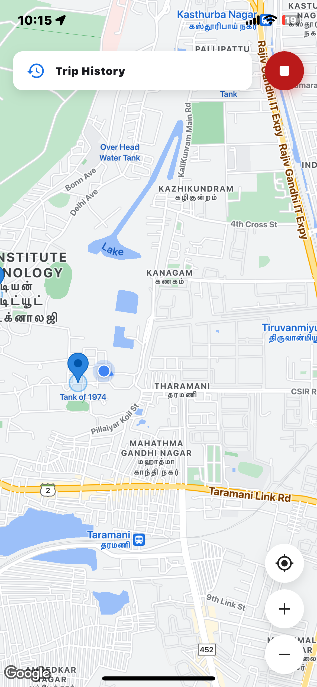
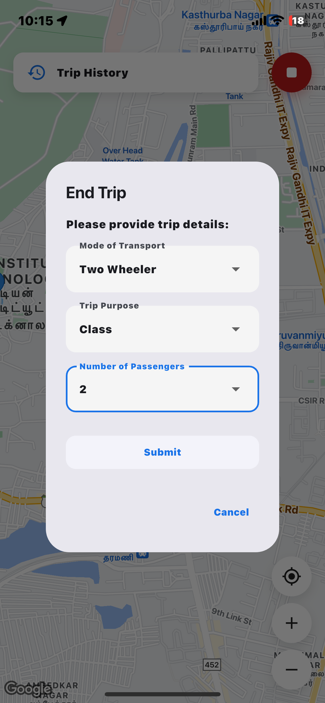

# IIT Madras Mobility Application

## Project Overview

The IITM-Mobile Smartphone Application is a innovative solution designed to collect travel demand and trip patterns data within the IIT Madras campus, addressing critical challenges of mobility, sustainability, and campus safety.

## App Screenshots & Flow

<table>
<tr>
    <td></td>
    <td>➡️</td>
    <td></td>
    <td>➡️</td>
    <td></td>
</tr>
</table>

<table>
<tr>
    <td></td>
    <td>➡️</td>
    <td></td>
</tr>
</table>

<table>
<tr>
    <td></td>
    <td>➡️</td>
    <td></td>
</tr>
</table>

## Motivation

The project aims to tackle several key challenges:

- Increasing vehicular traffic on campus
- Traffic congestion
- Air and noise pollution
- Limited parking spaces
- Wildlife protection and reducing animal-vehicle collisions

### Campus Context

- Campus Population: Approximately 9,800 people
- Campus Area: 617 acres
- Biodiversity:
  - Wildlife: Blackbuck, chital, bonnet macaque, and various smaller life forms
  - Flora: 300 species of trees and plants
  - Fauna: 100 species of birds (resident and migratory)

## Objectives

- Develop a smartphone application for accurate trip data collection
- Create a sustainable mobility solution
- Reduce private motorized trips by at least 70%
- Provide a mobility service with less than 10 minutes' notice
- Ensure minimal walking distance (within 3 minutes)

## Key Features

### Smartphone App Functionality

1. **User Privacy**

   - No continuous tracking
   - Data recorded only at predefined "virtual monuments"

2. **Virtual Monuments**

   - Geofenced areas with unique GPS coordinates
   - Reduced data collection errors
   - Enhanced user privacy

3. **User Registration**

   - Secure registration process
   - Optional phone number registration

4. **Data Logging**

   - Monument ID tracking
   - Date and time of entry/exit
   - Near real-time data transmission

5. **Additional Features**
   - Auto-start on phone restart
   - Minimalistic user interface
   - Battery optimization
   - Scalable monument management

## Technical Specifications

- **Backend Requirements**

  - Reliable GPS tracking
  - Robust data transmission
  - Real-time data synchronization
  - Multi-user support

- **Data Collection Methods**
  - Smartphone app
  - CCTV camera supplementary data
  - Vehicular pass tracking

## Tech Stack

- Flutter/React-Native for frontend
- Nest.js + Typescript for backend(Better version of Node.js)
- PostgreSQL Database
- TypeORM for orm
- AWS Ec2 Hosting

## Proposed Outcomes

- Comprehensive travel demand and trip pattern analysis
- Sustainable mobility solution for the campus
- Potential template for similar studies in gated campuses

## Future Enhancements

- Ride-hailing functionality
- Continuous data collection and analysis
